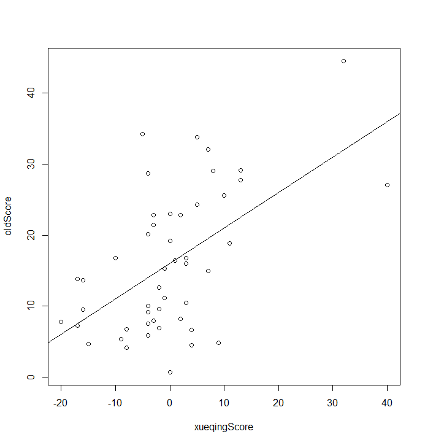
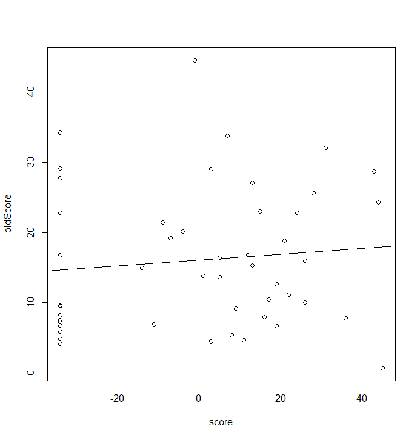
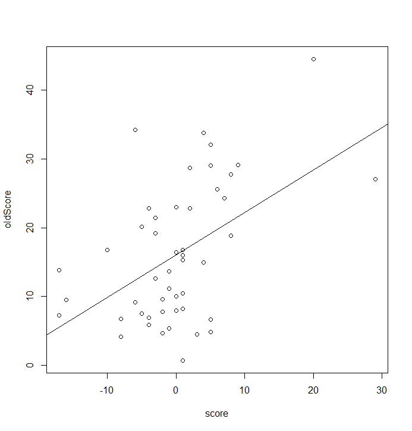
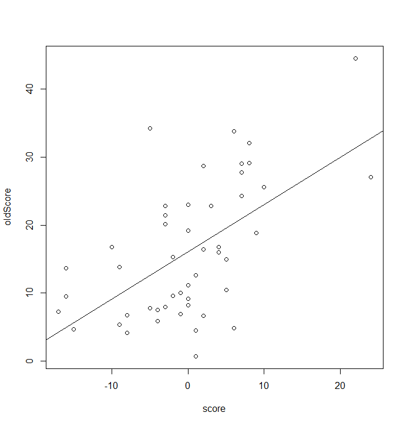
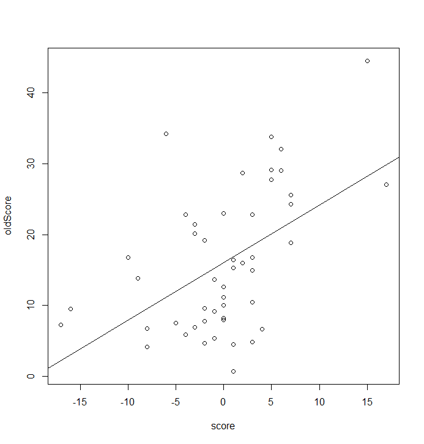

medicine-muScore
==========

有显著性的变量（基于相关系数）
---------
### NL
相关系数值：
```
               oldScore
NL.CCL17   -0.079291411
NL.CCL18   -0.086562711
NL.CCL22    0.109278587
NL.CCL27    0.006320145
NL..IFN.γ. -0.041992165
NL.IL13     0.191548290
NL.IL18    -0.016398469
NL.IL19    -0.045139547
NL.IL31     0.050036618
NL.IL33    -0.244847347
NL.IL4      0.114566674
NL.MMP12    0.033108402
```
显著性检验：
```
data:  oldScore and data$CCL17
t = -0.53948, df = 46, p-value = 0.5922

data:  oldScore and data$CCL18
t = -0.58931, df = 46, p-value = 0.5585

data:  oldScore and data$CCL22
t = 0.74563, df = 46, p-value = 0.4597

data:  oldScore and data$CCL27
t = 0.042866, df = 46, p-value = 0.966

data:  oldScore and data$`IFN-γ`
t = -0.28506, df = 46, p-value = 0.7769

data:  oldScore and data$IL13
t = 1.3237, df = 46, p-value = 0.1922

data:  oldScore and data$IL18
t = -0.11123, df = 46, p-value = 0.9119

data:  oldScore and data$IL19
t = -0.30646, df = 46, p-value = 0.7606

data:  oldScore and data$IL31
t = 0.33979, df = 46, p-value = 0.7356

data:  oldScore and data$IL33
t = -1.7128, df = 46, p-value = 0.09349 <<<<<<

data:  oldScore and data$IL4
t = 0.78218, df = 46, p-value = 0.4381

data:  oldScore and data$MMP12
t = 0.22468, df = 46, p-value = 0.8232
```
选`NL$IL33`

### LS
相关系数值：
```
                 oldScore
data.CCL17    0.039797106
data.CCL18   -0.053143332
data.CCL22    0.202109176
data.CCL27    0.118341394
data..IFN.γ.  0.291807130
data.IL13    -0.082457924
data.IL18     0.069993915
data.IL19    -0.042943835
data.IL31     0.003483419
data.IL33     0.191968995
data.IL4      0.088449836
data.MMP12    0.156350250
```
显著性检验：
```
data:  oldScore and data$CCL17
t = 0.27013, df = 46, p-value = 0.7883

data:  oldScore and data$CCL18
t = -0.36095, df = 46, p-value = 0.7198

data:  oldScore and data$CCL22
t = 1.3997, df = 46, p-value = 0.1683

data:  oldScore and data$CCL27
t = 0.80831, df = 46, p-value = 0.4231

data:  oldScore and data$`IFN-γ` <<<<<<
t = 2.0692, df = 46, p-value = 0.04417

data:  oldScore and data$IL13
t = -0.56117, df = 46, p-value = 0.5774

data:  oldScore and data$IL18
t = 0.47589, df = 46, p-value = 0.6364

data:  oldScore and data$IL19
t = -0.29153, df = 46, p-value = 0.772

data:  oldScore and data$IL31
t = 0.023626, df = 46, p-value = 0.9813

data:  oldScore and data$IL33
t = 1.3267, df = 46, p-value = 0.1912

data:  oldScore and data$IL4
t = 0.60226, df = 46, p-value = 0.55

data:  oldScore and data$MMP12
t = 1.0736, df = 46, p-value = 0.2886
```
选`LS$IFN-γ`

### 血清
相关系数值：
```
              oldScore
data.CCL17   0.4893293
data.CCL18   0.2782037
data.CCL22   0.1589100
data.CCL27   0.5038487
data..IFN.γ. 0.5093419
data.IL13    0.3744124
data.IL18    0.4655896
data.IL19    0.1454989
data.IL31    0.1852483
data.IL33    0.4838018
data.IL4     0.4609382
data.MMP12   0.3796799
```

显著性检验：
```
data:  oldScore and data$CCL17 <<<<<<
t = 3.8055, df = 46, p-value = 0.0004163

data:  oldScore and data$CCL18 <<<<<<
t = 1.9644, df = 46, p-value = 0.05554

data:  oldScore and data$CCL22
t = 1.0917, df = 46, p-value = 0.2807

data:  oldScore and data$CCL27 <<<<<<
t = 3.9561, df = 46, p-value = 0.0002613

data:  oldScore and data$`IFN-γ` <<<<<<
t = 4.0143, df = 46, p-value = 0.0002179

data:  oldScore and data$IL13 <<<<<<
t = 2.7386, df = 46, p-value = 0.008748

data:  oldScore and data$IL18 <<<<<<
t = 3.5681, df = 46, p-value = 0.0008539

data:  oldScore and data$IL19
t = 0.99744, df = 46, p-value = 0.3238

data:  oldScore and data$IL31
t = 1.2785, df = 46, p-value = 0.2075

data:  oldScore and data$IL33 <<<<<<
t = 3.7493, df = 46, p-value = 0.0004944

data:  oldScore and data$IL4 <<<<<<
t = 3.5228, df = 46, p-value = 0.0009771

data:  oldScore and data$MMP12 <<<<<<
t = 2.7836, df = 46, p-value = 0.007776
```
选`xueqing$CCL17`、`xueqing$CCL18`、`xueqing$CCL27`、`xueqing$IFN-γ`、`xueqing$IL13`、`xueqing$IL18`、`xueqing$IL33`、`xueqing$IL4`、`xueqing$MMP12`

回归分析
------------
### NL
```
Residuals:
    Min      1Q  Median      3Q     Max 
-13.252  -7.877  -1.952   5.399  27.049 

Coefficients:
            Estimate Std. Error t value Pr(>|t|)  
(Intercept)   7.8960     4.9585   1.592   0.1181  
NL$IL33      -0.6511     0.3802  -1.713   0.0935 .
---
Signif. codes:  0 ‘***’ 0.001 ‘**’ 0.01 ‘*’ 0.05 ‘.’ 0.1 ‘ ’ 1

Residual standard error: 9.749 on 46 degrees of freedom
Multiple R-squared:  0.05995,	Adjusted R-squared:  0.03951 
F-statistic: 2.934 on 1 and 46 DF,  p-value: 0.09349
```

### LS
```
Residuals:
    Min      1Q  Median      3Q     Max 
-21.447  -7.384  -1.717   4.800  27.997 

Coefficients:
            Estimate Std. Error t value Pr(>|t|)    
(Intercept)  24.7880     4.4500   5.570 1.27e-06 ***
LS$`IFN-γ`    0.7237     0.3498   2.069   0.0442 *  
---
Signif. codes:  0 ‘***’ 0.001 ‘**’ 0.01 ‘*’ 0.05 ‘.’ 0.1 ‘ ’ 1

Residual standard error: 9.617 on 46 degrees of freedom
Multiple R-squared:  0.08515,	Adjusted R-squared:  0.06526 
F-statistic: 4.282 on 1 and 46 DF,  p-value: 0.04417
```

### 血清
```
Residuals:
     Min       1Q   Median       3Q      Max 
-15.1141  -5.3498  -0.7507   6.4386  20.8182 

Coefficients:
                 Estimate Std. Error t value Pr(>|t|)
(Intercept)     -125.2802   142.6316  -0.878    0.385
xueqing$CCL17      1.5863     1.2108   1.310    0.198
xueqing$CCL18      6.7904     4.1247   1.646    0.108
xueqing$CCL27     -0.5584     6.7583  -0.083    0.935
xueqing$`IFN-γ`   12.0753    10.5013   1.150    0.257
xueqing$IL13      -2.3530     9.2835  -0.253    0.801
xueqing$IL18       3.8981     2.5320   1.540    0.132
xueqing$IL33      -5.1215    10.2538  -0.499    0.620
xueqing$IL4        6.0152     8.0063   0.751    0.457
xueqing$MMP12     -9.1105    20.8615  -0.437    0.665

Residual standard error: 8.372 on 38 degrees of freedom
Multiple R-squared:  0.4273,	Adjusted R-squared:  0.2917 
F-statistic:  3.15 on 9 and 38 DF,  p-value: 0.0062
```

mu-score回归分析（全部分开）
-----------
### NL
```
Residuals:
    Min      1Q  Median      3Q     Max 
-13.317  -7.942  -2.017   5.333  26.983 

Coefficients:
            Estimate Std. Error t value Pr(>|t|)    
(Intercept) 16.03958    1.40944  11.380  5.7e-15 ***
NLScore     -0.10552    0.06335  -1.666    0.103    
---
Signif. codes:  0 ‘***’ 0.001 ‘**’ 0.01 ‘*’ 0.05 ‘.’ 0.1 ‘ ’ 1

Residual standard error: 9.765 on 46 degrees of freedom
Multiple R-squared:  0.05688,	Adjusted R-squared:  0.03638 
F-statistic: 2.774 on 1 and 46 DF,  p-value: 0.1026
```


### LS
```
Residuals:
    Min      1Q  Median      3Q     Max 
-20.151  -7.664  -2.344   4.563  27.712 

Coefficients:
            Estimate Std. Error t value Pr(>|t|)    
(Intercept) 16.03958    1.38828  11.554 3.39e-15 ***
LSScore      0.10693    0.05173   2.067   0.0444 *  
---
Signif. codes:  0 ‘***’ 0.001 ‘**’ 0.01 ‘*’ 0.05 ‘.’ 0.1 ‘ ’ 1

Residual standard error: 9.618 on 46 degrees of freedom
Multiple R-squared:  0.08498,	Adjusted R-squared:  0.06509 
F-statistic: 4.272 on 1 and 46 DF,  p-value: 0.04439
```

无相关性

### 血清
```
Residuals:
     Min       1Q   Median       3Q      Max 
-15.6239  -6.2527  -0.5018   5.8402  20.6517 

Coefficients:
             Estimate Std. Error t value Pr(>|t|)    
(Intercept)   16.0396     1.2092  13.265  < 2e-16 ***
xueqingScore   0.4983     0.1107   4.502 4.57e-05 ***
---
Signif. codes:  0 ‘***’ 0.001 ‘**’ 0.01 ‘*’ 0.05 ‘.’ 0.1 ‘ ’ 1

Residual standard error: 8.377 on 46 degrees of freedom
Multiple R-squared:  0.3059,	Adjusted R-squared:  0.2908 
F-statistic: 20.27 on 1 and 46 DF,  p-value: 4.571e-05
```


mu-score回归分析（合并）
---------
### NL+LS
```
Residuals:
    Min      1Q  Median      3Q     Max 
-17.225  -7.440  -1.783   6.353  28.502 

Coefficients:
            Estimate Std. Error t value Pr(>|t|)    
(Intercept) 16.03958    1.44289  11.116 1.26e-14 ***
score        0.04190    0.05704   0.735    0.466    
---
Signif. codes:  0 ‘***’ 0.001 ‘**’ 0.01 ‘*’ 0.05 ‘.’ 0.1 ‘ ’ 1

Residual standard error: 9.997 on 46 degrees of freedom
Multiple R-squared:  0.01159,	Adjusted R-squared:  -0.009894 
F-statistic: 0.5396 on 1 and 46 DF,  p-value: 0.4663
```

无相关性

### NL+血清
```
Residuals:
    Min      1Q  Median      3Q     Max 
-15.957  -6.726  -1.472   6.944  21.867 

Coefficients:
            Estimate Std. Error t value Pr(>|t|)    
(Intercept)  16.0396     1.2625  12.704  < 2e-16 ***
score         0.6178     0.1607   3.845 0.000368 ***
---
Signif. codes:  0 ‘***’ 0.001 ‘**’ 0.01 ‘*’ 0.05 ‘.’ 0.1 ‘ ’ 1

Residual standard error: 8.747 on 46 degrees of freedom
Multiple R-squared:  0.2433,	Adjusted R-squared:  0.2268 
F-statistic: 14.79 on 1 and 46 DF,  p-value: 0.0003683
```


### LS+血清
```
Residuals:
    Min      1Q  Median      3Q     Max 
-16.034  -5.711  -1.521   6.842  21.630 

Coefficients:
            Estimate Std. Error t value Pr(>|t|)    
(Intercept)  16.0396     1.1833  13.555  < 2e-16 ***
score         0.6939     0.1441   4.816 1.62e-05 ***
---
Signif. codes:  0 ‘***’ 0.001 ‘**’ 0.01 ‘*’ 0.05 ‘.’ 0.1 ‘ ’ 1

Residual standard error: 8.198 on 46 degrees of freedom
Multiple R-squared:  0.3352,	Adjusted R-squared:  0.3208 
F-statistic:  23.2 on 1 and 46 DF,  p-value: 1.623e-05
```


### NL+LS+血清
```
Residuals:
    Min      1Q  Median      3Q     Max 
-16.151  -6.184  -1.667   6.610  23.026 

Coefficients:
            Estimate Std. Error t value Pr(>|t|)    
(Intercept)  16.0396     1.2443  12.891  < 2e-16 ***
score         0.8109     0.1991   4.072 0.000182 ***
---
Signif. codes:  0 ‘***’ 0.001 ‘**’ 0.01 ‘*’ 0.05 ‘.’ 0.1 ‘ ’ 1

Residual standard error: 8.621 on 46 degrees of freedom
Multiple R-squared:  0.2649,	Adjusted R-squared:  0.249 
F-statistic: 16.58 on 1 and 46 DF,  p-value: 0.0001818
```
