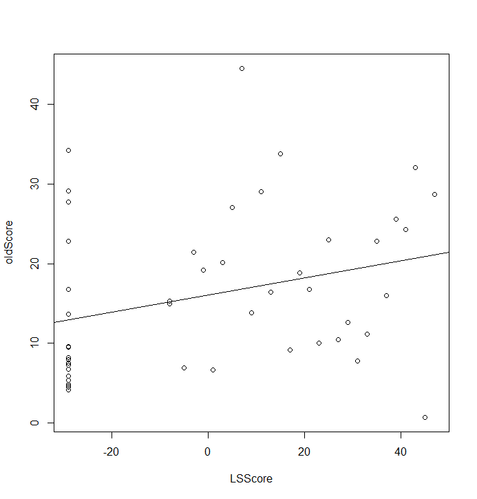

medicine-muScore
==========

有显著性的变量
------------
### NL
```
            Estimate Std. Error t value Pr(>|t|)   
(Intercept)  14.5448     9.7958   1.485  0.14655   
NL$CCL17     -0.6188     0.7658  -0.808  0.42447   
NL$CCL18      0.3174     0.8565   0.371  0.71314   
NL$CCL22      0.8744     0.5335   1.639  0.11014   
NL$CCL27      0.2710     0.5563   0.487  0.62919   
NL$`IFN-γ`    0.1589     0.4417   0.360  0.72129   
NL$IL13       1.1829     0.5194   2.278  0.02897 * 
NL$IL18      -0.4725     0.6077  -0.778  0.44205   
NL$IL19      -0.3951     0.8423  -0.469  0.64193   
NL$IL31       0.3407     0.4809   0.708  0.48342   
NL$IL33      -1.6340     0.5915  -2.762  0.00908 **
NL$IL4        0.2754     0.4090   0.673  0.50520   
NL$MMP12     -0.6256     0.7289  -0.858  0.39660   
```
选`NL$IL13`、`NL$IL33`

### LS
```
Coefficients:
            Estimate Std. Error t value Pr(>|t|)  
(Intercept) 32.66294   13.44491   2.429   0.0204 *
LS$CCL17    -0.61665    1.04816  -0.588   0.5601  
LS$CCL18    -0.06943    0.85339  -0.081   0.9356  
LS$CCL22     1.52887    0.89165   1.715   0.0953 .
LS$CCL27     0.29908    0.59554   0.502   0.6187  
LS$`IFN-γ`   1.08841    0.52512   2.073   0.0456 *
LS$IL13     -0.70085    0.61946  -1.131   0.2656  
LS$IL18     -0.26468    0.87713  -0.302   0.7646  
LS$IL19      0.15354    0.58645   0.262   0.7950  
LS$IL31     -0.14748    0.55427  -0.266   0.7917  
LS$IL33      0.29774    0.59514   0.500   0.6200  
LS$IL4       0.58940    0.49842   1.183   0.2450  
LS$MMP12    -0.53630    1.10482  -0.485   0.6304  
```
选`LS$CCL22`、`LS$IFN-γ`

### 血清
```
Coefficients:
                 Estimate Std. Error t value Pr(>|t|)
(Intercept)     -142.4356   158.7045  -0.897    0.376
xueqing$CCL17      1.2658     1.2262   1.032    0.309
xueqing$CCL18      5.7255     4.2457   1.349    0.186
xueqing$CCL22     -1.9918     1.9416  -1.026    0.312
xueqing$CCL27     -0.8906     7.2759  -0.122    0.903
xueqing$`IFN-γ`   13.0398    10.8767   1.199    0.239
xueqing$IL13      -4.8670     9.6505  -0.504    0.617
xueqing$IL18       3.7538     2.6243   1.430    0.161
xueqing$IL19      -1.0227     9.4906  -0.108    0.915
xueqing$IL31       1.9330     1.5473   1.249    0.220
xueqing$IL33       0.1061    10.9903   0.010    0.992
xueqing$IL4        6.2101     8.1755   0.760    0.453
xueqing$MMP12     -0.6502    21.8782  -0.030    0.976
```
全不选

mu-score回归分析（NL、LS分开）
-----------

### NL
```
Coefficients:
            Estimate Std. Error t value Pr(>|t|)    
(Intercept) 16.03958    1.44714  11.084  1.4e-14 ***
NLScore      0.02931    0.05680   0.516    0.608    
```

无相关性

### LS
```
Coefficients:
            Estimate Std. Error t value Pr(>|t|)    
(Intercept) 16.03958    1.35324  11.853  1.4e-15 ***
LSScore      0.16522    0.06285   2.629   0.0116 *  
```

有相关性

mu-score回归分析（NL、LS合并）
---------
```
Coefficients:
            Estimate Std. Error t value Pr(>|t|)    
(Intercept) 16.03958    1.35776  11.813 1.57e-15 ***
score        0.21041    0.08216   2.561   0.0138 *  
```

有相关性